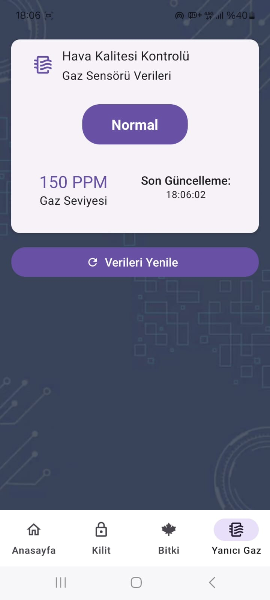

# IoT Mobile App 🌐

This mobile app allows users to monitor and control IoT devices via a user-friendly interface.

## Features
- **Real-time monitoring** of IoT devices
- **Device control** options
- **User-friendly interface**
- Local data storage for configuration
- Support for multiple IoT protocols
- **AWS Integration** for secure cloud storage and API communication
- **Paper UI Components** for modern and clean interface design

## Screenshots
Here are some screenshots from the app:





## Installation
1. Clone this repository:
   ```bash
   git clone https://github.com/rcpeken/IotMobile.git
